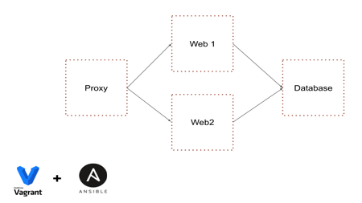

# Deploy Web application with Ansible roles

Learn how to organize your ansible code and manage environnements


## What you will learn

* use groups in inventory
* organize playbooks with roles and groups
* use files and templates
* use variables / groups
* use handler and notifier to manage configuratuin changes


## What you will build




## Provided for this lab

* vagrant file with all VM configured 
* inventory file
* common role 


## Prerequisite


Run vagrant 

```bash
vagrant up
```

Check all vm ping

```bash
ansible all -i provisioning/inventory.ini -m ping
```


## Create role common


### Initialize structure


```bash
ansible-galaxy init provisioning/roles/common
```

### Split tasks by logic

Example: configure ntp server

Create ntp yaml file beside main.yml

```yaml
#roles/common/tasks/ntp.yml
---
- name: install ntp
  apt: 
    name: ntp 
    state: present

```

> Nb : no tasks in includes 


Include in main.yml

```yaml
#roles/common/tasks/main.yml
- include: ntp.yml
```

### Templating

Use template module to render jinja templates

```yaml
- name: configure ntp file /etc/ntp.conf
  template: 
    src: ntp.conf.j2 
    dest: /etc/ntp.conf
    owner: root
    group: root
    mode: '0644'
  notify: restart ntp

```

> Nb: src path is relative to templates directory

You can use structure control and variable in templates

Example : declare ntp_servers variable (list type) 

```yaml
## declared in group_vars/all
ntp_servers:
  - '0.debian.pool.ntp.org'
  - '1.debian.pool.ntp.org'
  - '2.debian.pool.ntp.org'
```

Example : Use variable in jinja template

```html
driftfile /var/lib/ntp/drift

restrict 127.0.0.1 
restrict -6 ::1


server {{ ntp_server }} iburst


includefile /etc/ntp/crypto/pw

keys /etc/ntp/keys
```


### Variable by group

you can declare variables for hosts in speficied inventory group

Example : Inventory with 2 groups

```ini
[proxy]
proxy 192.168.20.11

[web]
web1 192.168.20.21
web2 192.168.20.22

```

* group_vars/all: match all servers (special)
* group_vars/proxy: match 192.168.20.11
* group_vars/web: match 192.168.20.21 and 192.168.22

> Tip: avoid to declare vars in playbooks


### Notify and handle event

You can emit event after change (ex: config changed)

Example : emit 'restart ntp' 

```yaml
- name: configure ntp file /etc/ntp.conf
  template: 
    src: ntp.conf.j2 
    dest: /etc/ntp.conf
    owner: root
    group: root
    mode: '0644'
  notify: restart ntp

```

Handlers are stored in '<role_name>/handlers/ directory'

Example : Listen to 'restart ntp'

```yaml
## common/handlers/main.yml

- name: restart ntp
  service: 
    name: ntp 
    state: restarted
```

### Copy files

From local files directories using copy module

```yaml
- name: Copy application files
  copy:
    src: "{{ role_path }}/files/images"
    dest: /var/www/html
  notify: restart nginx
```

From repository using git module

```yaml
- git:
    repo: 'https://foosball.example.org/path/to/repo.git'
    dest: /srv/checkout
    version: release-0.22
```


## Gather all roles

By convention, define a site.ym with calls all needed roles for specified hosts


```yaml
#site.yml
---

- name: Apply common configuration to all hosts
  hosts: all
  remote_user: vagrant
  become: yes
  
  roles:
    - common

- name: Apply Web configuration to web hosts
  hosts: web
  remote_user: vagrant
  become: yes
  
  roles:
    - web
```

Use ansible playbook

```
ansible-playbook -i provisioning/inventory.ini provisioning/site.yml
```

### Ansible Modules

* Ansible provide a [List of modules](https://docs.ansible.com/ansible/latest/user_guide/modules_intro.html)
* You can also use community based roles on [Ansible Galaxy](https://galaxy.ansible.com/) 

> Nb: Ansible is migrating to [collections](https://www.ansible.com/blog/thoughts-on-restructuring-the-ansible-project)


### Testing

Ansible provide a set of tools to test your playbook and roles ([Article Ansible](https://www.ansible.com/blog/testing-ansible-roles-with-docker)
[Molecule framework](https://github.com/ansible/molecule) can help too


## Exercices

### Configure Proxy role

* configure nginx as reverse proxy to serve web1 or web2
* create role proxy for related vm

Tips : 
* use nginx template with upstream and proxy pass
* use group variables 


#### How to check ? 

You should see web1 or web2 page content each time you refresh proxy IP


### Configure database role

* create role database for vm
* configure connection in web application code 


Tips : 
* use group variables


#### How to check ? 

Display list from database table