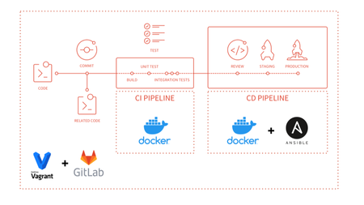

# Gitlab + CI + CD with Ansible

Learn how to manage CI and CD with gitlab + docker + ansible 

## What you will learn

* setup a gitlab server
* configure runner for CI 
* deploy code with ansible for CD

## What you will build




## What you Need

* Install gitlabce with ansible galaxy
* scm git to build code
* deploy with ansible if build ok


Use galaxy module : https://galaxy.ansible.com/geerlingguy/gitlab


Install inline :

```bash
ansible-galaxy install geerlingguy.gitlab
```
or (recommanded)

Install role from file : 

```bash
ansible-galaxy install -r requirements.yml
```

Check everythin ok 

```bash
ansible gitlab -i inventory -m ping
```

## playbook gitlab

```bash
ansible-playbook -i inventory gitlabce.yml
```

When succeed

* Access gilab on VM HOST 
* change password with 'adminadmin'
* access admin with 'root' and previous password


## Ajouter des runners

Go to URL '/admin/runners' to retrieve runner token


```bash
ansible-playbook -i inventory gitlab-runner.yml
```

Check everything ok

```bash
ansible -i inventory gitlab-runner -m ping 
```

```bash
ansible -i inventory gitlab-runner  gitlab-runner.yml --extra-var gitlab_registration_token='TOKEN'
```


## Configure CI

### Clone project 

example : @todo


### Configure gitlab ci

add .gitlab-ci.yml

[Example by gitlabci](https://gitlab.com/gitlab-examples/ssh-private-key/) 


Example for Nodejs 

```yaml
image: node:11

stages:
  - build
  - test
  - deploy

cache:
  paths:
    - node_modules/
    - dist

install_dependencies:
  stage: build
  script:
    - npm install
    - npm run build
  artifacts:
    paths:
      - node_modules/

testing_testing:
  stage: test
  script: npm test
```


## Configure CD

Create deploy key to let web werver access repository

`project > settings > Repository > Deploy Keys`


Use docker image with andible to deploy to our server

`gableroux/ansible:2.7.10`


Use secret environement provided by gitlab

`project > settings > CI/CD > Variable`


Create `INVENTORY` file variable with content 

```
[web]
192.168.33.31
```

Create `SSH_PRIVATE_KEY` file variable with content of the web vm private key 


Path for our vagrant web VM

```
.vagrant/machines/webdev/virtualbox/private_key
```


Update `gitlab-ci.yml` to use these variables in deploy stage

```yaml
  
.ansible: &ansible # Hidden key that defines an anchor
  stage: deploy
  #when: manual
  image: gableroux/ansible:2.7.10
  before_script:
    ## Install ssh-agent if not already installed, it is required by Docker.
    ## (change apt-get to yum if you use an RPM-based image)
    - 'which ssh-agent || ( apt-get update -y && apt-get install openssh-client git -y )'
    
    ## Run ssh-agent (inside the build environment)
    - eval $(ssh-agent -s)

    ## Create the SSH directory and give it the right permissions
    - mkdir ~/.ssh/
    - chmod 700 ~/.ssh
    
    # custom ssh config
    #- echo "$SSH_CONFIG" > ~/.ssh/config

    #- echo "$SSH_KNOWN_HOSTS" > ~/.ssh/known_hosts
    - ssh-keyscan 192.168.33.31 >> ~/.ssh/known_hosts
    - chmod 644 ~/.ssh/known_hosts
    
    - chmod 600 $SSH_PRIVATE_KEY
    #- echo "$SSH_PRIVATE_KEY" | tr -d '\r' | ssh-add - > /dev/null

deploy-master:
  <<: *ansible  # Merge the contents of the 'ansible' alias
  script:

    - ansible --version
    - ansible all -m copy -a "src=dist/ dest=/var/www/html mode=0755 owner=www-data group=www-data" -i $INVENTORY -b  -u vagrant --private-key=$SSH_PRIVATE_KEY
  only:
    - master

```

Gitlab Ci now deploy code to specified machines on Success !


An optimization would use playbook

```yaml
---
- host: web
  task:
    - name: Create install directory
      file:
        state: directory
        path: /var/www/html
        owner: www-data
        group: www-data
        mode: 0755
    - name: Copy files to remote host
      copy:
        src: dist
        dest: /var/www/html
        owner: www-data
        group: www-data
        mode: 0755

```

To deploy our application using our playbook we execute the following Ansible command.

```bash
ansible-playbook -i $INVENTORY deploy.yml -b -u vagrant  --private-key=$SSH_PRIVATE_KEY

```


## Going Further 

Beware This code is for demonstration only :)

### Pushing VS Pulling Code 

We used Deploy server to push code

A better approach notify machines a new code is ready to deploy
Machines pull code from artefact repository 

### Manage roles an permissions

ansible tower / awx let ops manage playbooks / privileges / inventories  


